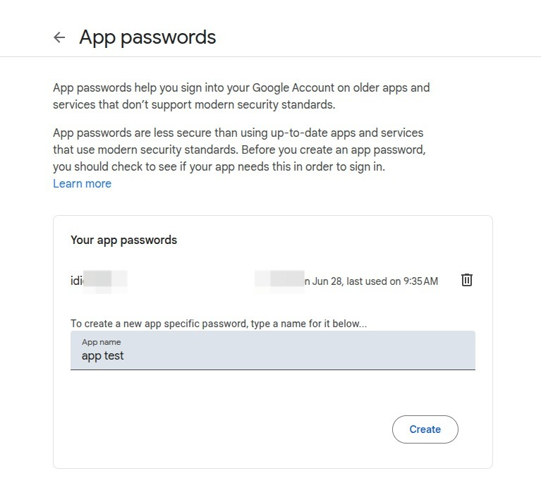
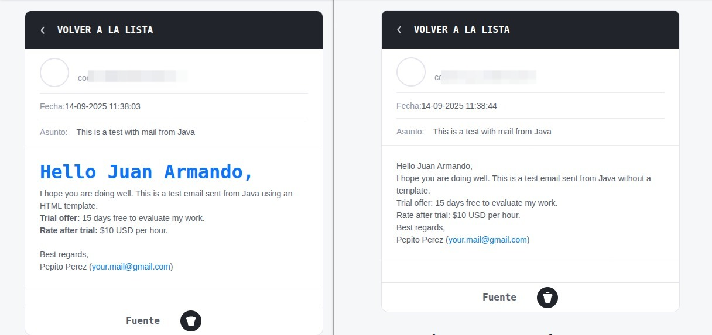

# 📧 Send Mail
The purpose of this project is to show how to send an email in a simple way, using your **Google** account.
You have to create an App Password, here is a guide:

---

## 🟥 With Gmail

### 1️⃣  Enable two-step verification (2FA)
👉 Go to your account at [google account](https://myaccount.google.com/)

👉 Go to **Security** → **Two-step verification**.
- Set up your number or the Google Authenticator app.

⚠️ _**This is mandatory**_: without 2FA, Google will not let you use application passwords.

### 2️⃣  Access the application passwords section
- Once 2FA is active, go to [apppasswords](https://myaccount.google.com/apppasswords), login again (**Google will ask for your password**).

- Create a new application password
  

- Click on Create.
- Get the application key
  Google will generate a 16-character code which you should save (example: abcd efgh ijkl mnop).

💡 Use this code as your password in the program.

---

## 📝 Email Content
You have **two ways** to send content:
1. 🌐 Using an **HTML template**
2. 📄 Using **plain text**

Here’s an example of how it looks with each:

